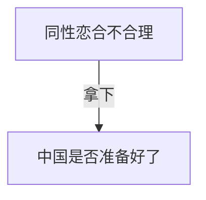

1. 同性恋--->平权
2. 社会福利
3. 降低艾滋病传播

---------

1. 性关系混乱？
2. 互联网上主要是年轻人，但社会上真正掌权的是较老的人；人群中依然存在着偏见，只是迫于政治正确没有说。

------------

1. 同性离婚率高，结婚人数少
2. 婚姻的意义（价值）
3. 同性婚姻中长大的孩子的成长程度更高
4. 同性恋和基因有关
5. 35岁以下支持度达85%
6. **非婚同居制度**
   1. 同性恋正常化应普遍化
   2. 同性恋滥交严重、不愿意有长期关系 （QR立论）
   3. 婚姻不仅仅是爱情，而与社会息息相关
7. 国外实施情况并不理想？

--------------

1. 把事情摆到台面上
2. 损益比计算
3. 主语？
4. 权力
5. 渐进定义（逐渐合法化）

7. 先改法律还是先改观念
8. 

--------

## 资料

1. 他国先例
2. 老一代人对同性恋婚姻的支持度改变
3. 

## 辩位

1. Taichi
2. Jin
3. 温酒
4. 张